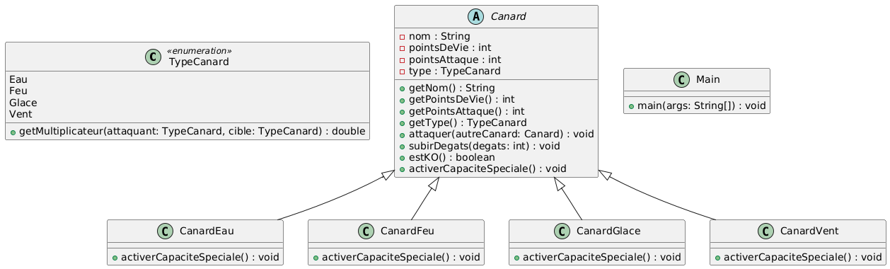
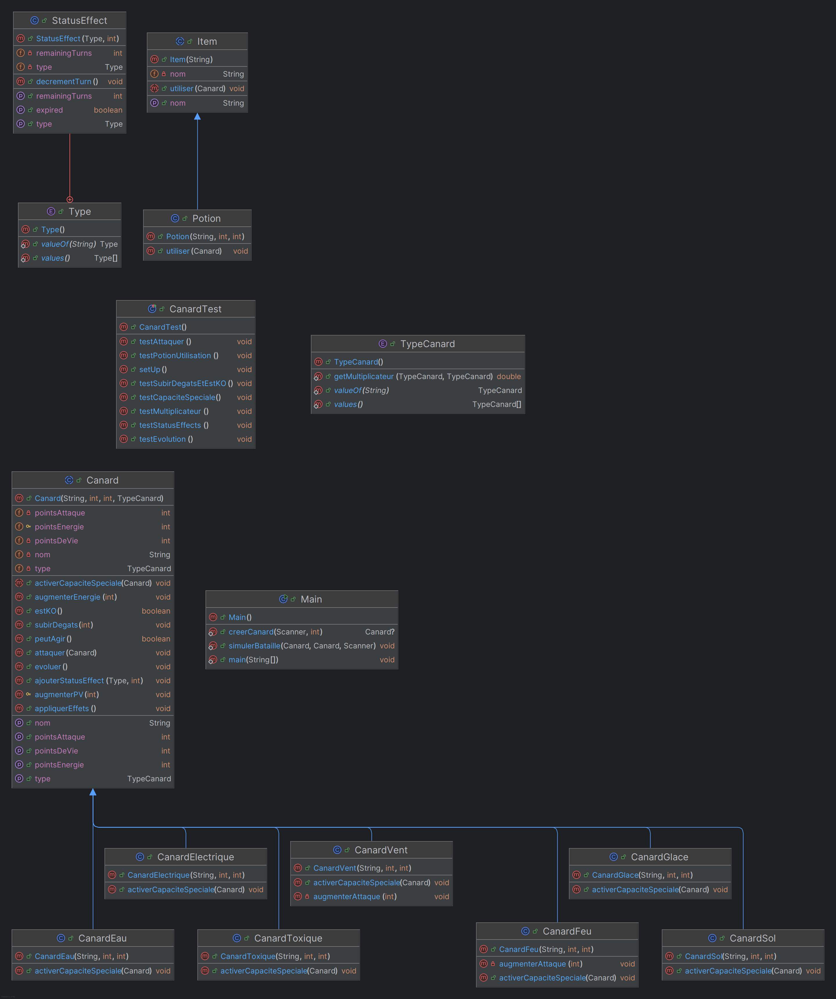

Diagramme de classe avant de débuter le projet :

Diagramme de classie a la fin du projet: 

# Questionnements sur la modélisation

## 1. Quelles classes pourraient être abstraites ?
Je pense que la classe Canard devrait etre abstraite car elle regroupe tous les attributs et methodes communes a tous les canards (nom, points de vie, points d'attaque, type, etc.). En la rendant abstraite on oblige les classes filles (CanardEau, CanardFeu, CanardGlace, CanardVent) a implementer leur propre version de certaines methodes notamment activerCapaciteSpeciale(). Cela permet de mieux definir le comportement spécifique de chaque type de canard

## 2.Quels comportements communs pourraient être définis dans une interface ?
On pourrait creer une interface par exemple Combattant qui regroupe des methodes comme attaquer(),subirDegats() et estKO(). Toutes les entites qui doivent participer aux combats meme si elles ne font pas partie de la hierarchie de Canard devront implementer ces methodes. Cela uniformise le comportement des entites en combat et facilite l'extension du projet

## 3. Comment représenter un changement de statut (par exemple,brûlé ou paralysé) dans la modélisation ?
Une solution serait de creer une énumération (enum) appelee Statut qui definirait les differents etats possibles (NORMAL, BRULE, PARALYSE, etc.). Chaque canard pourrait alors avoir un attribut indiquant son statut actuel. Pour une approche plus evoluée, on pourrait utiliser le State Pattern (https://refactoring.guru/design-patterns/state/java/example) afin de modifier dynamiquement le comportement du canard en fonction de son statut (par exe reduire les pts de vie a chaque tour s'il est brule ou l'empecher d'agir s'il est paralyse)

## 4. Quels seraient les avantages d’utiliser une classe ou une interface supplémentaire pour gérer les capacités spéciales ?
Utiliser une classe ou une interface supplementaire pour gerer les capacites speciales permet de separer la logique de ces capacites du reste du comportement du canard. Cela rend le code plus modulaire et plus facile a maintenir. Par exemple chaque capacite speciale pourrait etre implementee dans une classe distincte qui implemente une interface CapaciteSpeciale. Cela facilite l'ajout de nouvelles capacites sans modifier le code de la classe main.java.org.canard.Canard ni de ses sous-classes et simplifie egalement les tests unitaires et le debug

## 5. Quels défis sont associés à l’extensibilité de votre modèle pour ajouter de nouveaux types de canards ou de nouvelles capacités ?
Le principal défi est de gérer la complexité qui augmente à chaque ajout. Quand on ajoute de nouveaux types ou capacités les interactions (forces, faiblesses, statuts) deviennent plus difficiles à organiser. Il faut que le modèle reste flexible et simple ce qui peut nécessiter l'utilisation de design patterns comme le State Pattern. Il faut aussi veiller à ce que l'interface reste claire et que les tests unitaires couvrent bien les nouvelles fonctionnalités

## Réalisations bonus : Tous les bonus ont été réalisé.

# Description des Choix Techniques

1. Conception OO  
La classe Canard est abstraite et regroupe les attributs et methodes communes (nom, PV, PA, type, PE). Les sous-classes (CanardEau, CanardFeu, etc.) heritent de cette classe et implementent leur propre capacite speciale.

2. Gestion des types  
L'enum TypeCanard definit les differents types et contient la methode getMultiplicateur pour calculer les interactions (forces/faiblesses) entre canards.

3. Effets de statut  
La classe StatusEffect permet de gerer les effets comme brule, gele, paralys, et poison. Cela rend le systeme modulaire et facilite l'ajout de nouveaux effets.

4. Tests
Tests réalisés en TDD tout au long du developpement.
